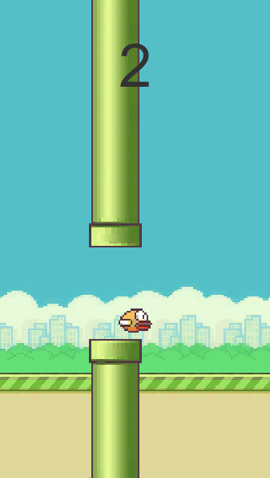

# Flappy Bird Clone




## 🎮 Oyun Hakkında
Flappy Bird, reflekslerini test eden bağımlılık yapıcı bir mobil oyundur! Oyuncular, ekrana dokunarak kuşu boruların arasından geçirmeye çalışır. Zorlayıcı oynanışıyla eğlenceli ve rekabetçi bir deneyim sunar.

## 🛠 Kurulum
1. **Depoyu Klonla:**
   ```sh
   git clone https://github.com/Tolga-Uslu/Flappy-Bird.git
   ```
2. **Proje Klasörüne Gir:**
   ```sh
   cd Flappy-Bird
   ```
3. **Unity ile Aç:**
   - Unity'yi aç ve `Flappy-Bird` klasörünü projeye dahil et.

## 📚 Nasıl Oynanır?
- **Dokun/Tıkla:** Kuşu yukarı zıplat.
- **Engellerden Kaç:** Borulara çarpmadan ilerle.
- **Skorunu Yükselt:** Ne kadar uzağa gidersen, o kadar yüksek puan alırsın.
- **Game Over:** Borulara çarpınca oyun biter ve tekrar oynayabilirsin.

## 🔧 Kullanılan Teknolojiler
- **Unity (C#)**
- **2D Fizik Motoru**
- **Pixel Art Grafikleri**

## 🛠 Geliştirici Notları
- Oyun Unity ile geliştirildi ve optimize edildi.
- Ses efektleri ve animasyonlar eklenebilir.
- Yeni mekanikler ve farklı zorluk seviyeleri düşünülebilir.

## 📚 Lisans
Bu proje açık kaynaklıdır ve geliştirmeye açıktır.

---
Bu dosyayı güncellemek veya katkıda bulunmak için pull request gönderebilirsin! 🚀

